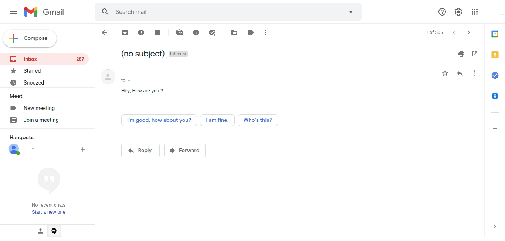
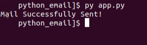
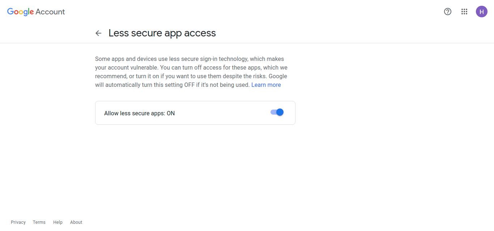

# Sending emails by using python!


## Code

```
import smtplib


sender_email = "sender@gmail.com"
password = "password"
receiver_email = "receiver@gmail.com"
message = "Hey, How are you ?"
server = smtplib.SMTP_SSL("smtp.gmail.com", 465)
server.login(sender_email,password)
server.sendmail(sender_email, receiver_email, message)
print('Mail Successfully Sent!')
server.quit()


```

### Change the sender_email, password and receiver_email with valid credentials.


## Output





## Error

```
Traceback (most recent call last):
  File "app.py", line 8, in <module>
    server.login(sender_email,password)
  File "/usr/lib/python3.8/smtplib.py", line 734, in login
    raise last_exception
  File "/usr/lib/python3.8/smtplib.py", line 723, in login
    (code, resp) = self.auth(
  File "/usr/lib/python3.8/smtplib.py", line 646, in auth
    raise SMTPAuthenticationError(code, resp)
smtplib.SMTPAuthenticationError: (535, b'5.7.8 Username and Password not accepted. Learn more at\n5.7.8  https://support.google.com/mail/?p=BadCredentials a136sm83140pfd.149 - gsmtp')
```

### If you're facing this error, goto the below given link switch on the allow less secure apps. 


https://www.google.com/settings/security/lesssecureapps


